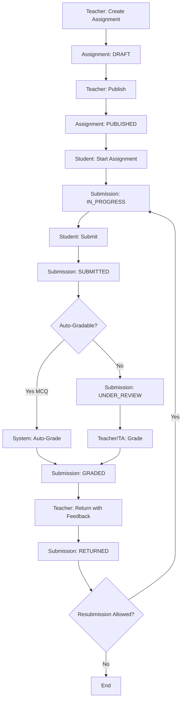

# Arquitectura LMS - Sistema de Gestión de Aprendizaje

**Versión**: 1.0
**Fecha**: 13/12/2025
**Estado**: Design Document

---

## Tabla de Contenidos

1. [Visión General](#visión-general)
2. [Roles y Permisos](#roles-y-permisos)
3. [Workflow de Evaluaciones](#workflow-de-evaluaciones)
4. [Tipos de Evaluaciones](#tipos-de-evaluaciones)
5. [Base de Datos](#base-de-datos)
6. [APIs y Endpoints](#apis-y-endpoints)
7. [Componentes Frontend](#componentes-frontend)
8. [Estados y Transiciones](#estados-y-transiciones)
9. [Roadmap de Implementación](#roadmap-de-implementación)

---

## Visión General

Sistema LMS integrado en Astro que permite:
- Creación y gestión de cursos con contenido markdown
- Sistema de evaluaciones múltiples (MCQ, ensayos, código, peer review)
- Workflow completo: Submit → Review → Grade → Feedback
- Sistema granular de permisos por curso y assignment
- Dashboard para teachers y students

### Principios de Diseño

1. **Markdown-first**: Contenido en markdown, evaluaciones en YAML embebido
2. **Type-safe**: TypeScript en todo el stack
3. **Progressive Enhancement**: Funciona sin JS, mejor con JS
4. **Astro DB**: Base de datos integrada (SQLite local, production ready)
5. **Component-based**: Componentes reutilizables Astro/React

---

## Roles y Permisos

### Jerarquía de Roles

```
Admin (superuser)
  └── Teacher (instructor)
      ├── TA (teaching assistant)
      └── Student (learner)
```

### Matriz de Permisos

#### **Course-Level Permissions**

| Action | Admin | Teacher | TA | Student | Guest |
|--------|-------|---------|-------|---------|-------|
| View course | ✅ | ✅ | ✅ | ✅* | ✅** |
| Edit course | ✅ | ✅ | ❌ | ❌ | ❌ |
| Delete course | ✅ | ✅ | ❌ | ❌ | ❌ |
| Manage students | ✅ | ✅ | ✅ | ❌ | ❌ |
| View analytics | ✅ | ✅ | ✅ | ❌ | ❌ |

\* If enrolled or course is public
\*\* Only if course is public

#### **Assignment-Level Permissions**

| Action | Admin | Teacher | TA | Student | Guest |
|--------|-------|---------|-------|---------|-------|
| View assignment | ✅ | ✅ | ✅ | ✅* | ❌ |
| Submit assignment | ❌ | ❌ | ❌ | ✅* | ❌ |
| View submissions (all) | ✅ | ✅ | ✅ | ❌ | ❌ |
| View own submission | ✅ | ✅ | ✅ | ✅ | ❌ |
| Grade submission | ✅ | ✅ | ✅ | ❌ | ❌ |
| Edit assignment | ✅ | ✅ | ❌ | ❌ | ❌ |
| Delete assignment | ✅ | ✅ | ❌ | ❌ | ❌ |

\* Only if enrolled in course

#### **Submission-Level Permissions**

| Action | Admin | Teacher | TA | Student (owner) | Student (peer) |
|--------|-------|---------|-------|-----------------|----------------|
| View submission | ✅ | ✅ | ✅ | ✅ | ✅* |
| Edit submission | ✅ | ✅** | ❌ | ✅*** | ❌ |
| Delete submission | ✅ | ✅ | ❌ | ✅*** | ❌ |
| Grade submission | ✅ | ✅ | ✅ | ❌ | ✅* |
| View feedback | ✅ | ✅ | ✅ | ✅ | ❌ |
| Provide feedback | ✅ | ✅ | ✅ | ❌ | ✅* |

\* Only if peer review is enabled
\*\* Only before grading
\*\*\* Only before deadline or if resubmission is allowed

### Permission Scopes

```typescript
type PermissionScope = 
  | 'course:view'
  | 'course:edit'
  | 'course:delete'
  | 'course:manage-students'
  | 'assignment:view'
  | 'assignment:submit'
  | 'assignment:grade'
  | 'assignment:edit'
  | 'submission:view'
  | 'submission:grade'
  | 'feedback:view'
  | 'feedback:create';
```

---

## Workflow de Evaluaciones

### Estado del Assignment (Sistema)

```
DRAFT → PUBLISHED → CLOSED → ARCHIVED
```

### Estado del Submission (Usuario)

```
NOT_STARTED → IN_PROGRESS → SUBMITTED → UNDER_REVIEW → GRADED → RETURNED
                    ↓
                SAVED_DRAFT
```

### Workflow Completo



### Transiciones de Estado

#### **Assignment States**

| From | To | Trigger | Who | Conditions |
|------|------|---------|-----|------------|
| DRAFT | PUBLISHED | publish() | Teacher | Content complete |
| PUBLISHED | CLOSED | close() | Teacher/System | Past deadline |
| CLOSED | ARCHIVED | archive() | Teacher | After grace period |
| * | DRAFT | revert() | Teacher | Before submissions |

#### **Submission States**

| From | To | Trigger | Who | Conditions |
|------|------|---------|-----|------------|
| - | IN_PROGRESS | start() | Student | Assignment PUBLISHED |
| IN_PROGRESS | SAVED_DRAFT | save() | Student | Before deadline |
| IN_PROGRESS | SUBMITTED | submit() | Student | Before deadline |
| SUBMITTED | UNDER_REVIEW | assign_grader() | System | Manual grading |
| SUBMITTED | GRADED | auto_grade() | System | MCQ type |
| UNDER_REVIEW | GRADED | grade() | Teacher/TA | - |
| GRADED | RETURNED | return_feedback() | Teacher | Feedback added |
| RETURNED | IN_PROGRESS | resubmit() | Student | Resubmit allowed |

---

## Tipos de Evaluaciones

### 1. Multiple Choice Questions (MCQ)

**Características:**
- Auto-gradable
- Instant feedback
- Unlimited attempts (configurable)
- Progress tracking

**YAML Schema:**
```yaml
id: unique-question-id
type: mcq
mode: self | proctored
points: 1
attempts: unlimited | 1 | 2 | 3
prompt: "Question text"
options:
  - "[x] Correct answer"
  - "[ ] Wrong answer"
  - "[ ] Wrong answer"
  - "[ ] Wrong answer"
shuffle: true | false
clue1: "Hint after first fail"
clue2: "Hint after second fail"
explanation: "Full explanation"
```

### 2. Short Answer

**Características:**
- Text input (max 500 chars)
- Manual or AI-assisted grading
- Rubric-based scoring

**YAML Schema:**
```yaml
id: unique-question-id
type: short-answer
points: 5
prompt: "Question text"
answer_key: "Expected answer or keywords"
grading_rubric:
  - criteria: "Key concept mentioned"
    points: 2
  - criteria: "Example provided"
    points: 2
  - criteria: "Clear expression"
    points: 1
```

### 3. Essay

**Características:**
- Rich text editor
- Manual grading
- Detailed rubric
- Peer review option

**YAML Schema:**
```yaml
id: unique-essay-id
type: essay
points: 20
word_limit: 500
prompt: "Essay prompt"
rubric:
  - criteria: "Thesis clarity"
    points: 5
  - criteria: "Argumentation"
    points: 10
  - criteria: "Grammar"
    points: 5
peer_review:
  enabled: true
  reviewers_per_submission: 2
  points_for_reviewing: 2
```

### 4. Code Evaluation

**Características:**
- Code editor with syntax highlighting
- Test cases
- Auto-run tests
- Manual code review

**YAML Schema:**
```yaml
id: unique-code-id
type: code
language: python | javascript | java
points: 15
prompt: "Problem description"
starter_code: |
  def solution(input):
      # Your code here
      pass
test_cases:
  - input: "[1, 2, 3]"
    expected: "6"
    points: 5
  - input: "[10, -5, 20]"
    expected: "25"
    points: 5
hidden_tests: true | false
```

### 5. Peer Review

**Características:**
- Students review peer submissions
- Structured review form
- Points for quality reviews
- Teacher moderation

**Schema:**
```yaml
id: unique-peer-review-id
type: peer-review
points: 10
assignment_id: essay-id
review_deadline: 2024-01-20
review_form:
  - question: "Is the thesis clear?"
    type: scale
    scale: 1-5
  - question: "Provide constructive feedback"
    type: text
calibration_required: true
```

---

## Base de Datos

### Esquema Completo

```typescript
// === EXISTING TABLES ===

table User {
  id: text (PK)
  email: text (unique)
  name: text
  emailVerified: boolean
  image: text
  role: 'student' | 'teacher' | 'admin' | 'ta'
  createdAt: date
  updatedAt: date
}

table Session {
  id: text (PK)
  userId: text (FK → User)
  expiresAt: date
}

table Enrollment {
  id: text (PK)
  userId: text (FK → User)
  courseId: text
  enrolledAt: date
  status: 'active' | 'completed' | 'dropped'
  role: 'student' | 'ta' // Role within course
}

// === NEW/UPDATED TABLES ===

table Assignment {
  id: text (PK)
  courseId: text
  lessonId: text // From content collection
  title: text
  description: text
  type: 'mcq' | 'short-answer' | 'essay' | 'code' | 'peer-review'
  points: integer
  dueDate: date (nullable)
  closedDate: date (nullable)
  status: 'draft' | 'published' | 'closed' | 'archived'
  settings: json // Type-specific settings
  createdBy: text (FK → User)
  createdAt: date
  updatedAt: date
}

table Submission {
  id: text (PK)
  assignmentId: text (FK → Assignment)
  userId: text (FK → User)
  status: 'in_progress' | 'saved_draft' | 'submitted' | 'under_review' | 'graded' | 'returned'
  payload: json // Student's answers
  score: integer (nullable)
  maxScore: integer
  attempts: integer
  submittedAt: date (nullable)
  gradedAt: date (nullable)
  gradedBy: text (FK → User, nullable)
  feedback: text (nullable)
  createdAt: date
  updatedAt: date
}

table EvalResponse {
  id: text (PK)
  submissionId: text (FK → Submission)
  questionId: text // From eval block
  answer: json // Student's answer for this question
  isCorrect: boolean (nullable) // For auto-gradable
  score: integer (nullable)
  feedback: text (nullable)
  attemptNumber: integer
  answeredAt: date
}

table Rubric {
  id: text (PK)
  assignmentId: text (FK → Assignment)
  criteria: json // Array of criteria with points
  createdBy: text (FK → User)
  createdAt: date
}

table Grade {
  id: text (PK)
  submissionId: text (FK → Submission)
  rubricId: text (FK → Rubric, nullable)
  criteriaScores: json // Map of criteria → score
  totalScore: integer
  feedback: text
  gradedBy: text (FK → User)
  gradedAt: date
}

table PeerReview {
  id: text (PK)
  submissionId: text (FK → Submission) // Being reviewed
  reviewerId: text (FK → User) // Who is reviewing
  reviewData: json // Structured review responses
  score: integer (nullable) // Quality score for review
  status: 'pending' | 'completed' | 'skipped'
  completedAt: date (nullable)
  createdAt: date
}

table ActivityLog {
  id: text (PK)
  userId: text (FK → User)
  entityType: 'assignment' | 'submission' | 'grade'
  entityId: text
  action: 'create' | 'update' | 'delete' | 'view' | 'submit' | 'grade'
  metadata: json
  timestamp: date
}
```

### Índices Necesarios

```sql
-- Performance indexes
CREATE INDEX idx_submission_user ON Submission(userId);
CREATE INDEX idx_submission_assignment ON Submission(assignmentId);
CREATE INDEX idx_submission_status ON Submission(status);
CREATE INDEX idx_evalresponse_submission ON EvalResponse(submissionId);
CREATE INDEX idx_enrollment_user ON Enrollment(userId);
CREATE INDEX idx_enrollment_course ON Enrollment(courseId);
CREATE INDEX idx_grade_submission ON Grade(submissionId);
CREATE INDEX idx_peerreview_reviewer ON PeerReview(reviewerId);
CREATE INDEX idx_activitylog_user ON ActivityLog(userId);
CREATE INDEX idx_activitylog_timestamp ON ActivityLog(timestamp);

-- Composite indexes
CREATE INDEX idx_submission_user_assignment ON Submission(userId, assignmentId);
CREATE INDEX idx_submission_status_graded ON Submission(status, gradedAt);
```

---

## APIs y Endpoints

### RESTful API Structure

```
/api/
  ├── assignments/
  │   ├── [id]/
  │   │   ├── GET      # View assignment
  │   │   ├── PUT      # Update assignment
  │   │   ├── DELETE   # Delete assignment
  │   │   └── publish  # POST - Publish assignment
  │   └── POST         # Create assignment
  │
  ├── submissions/
  │   ├── [id]/
  │   │   ├── GET      # View submission
  │   │   ├── PUT      # Update draft
  │   │   ├── DELETE   # Delete draft
  │   │   └── submit   # POST - Submit for grading
  │   └── POST         # Create new submission
  │
  ├── eval/
  │   ├── submit       # POST - Submit MCQ answer
  │   └── [id]/
  │       └── response # POST - Save intermediate answer
  │
  ├── grades/
  │   ├── [submissionId]/
  │   │   ├── GET      # View grade
  │   │   ├── POST     # Create grade
  │   │   └── PUT      # Update grade
  │   └── bulk         # POST - Grade multiple
  │
  ├── peer-review/
  │   ├── assign       # POST - Assign reviews
  │   ├── [id]/
  │   │   ├── GET      # View review assignment
  │   │   └── submit   # POST - Submit review
  │   └── calibrate    # POST - Calibration exercise
  │
  └── analytics/
      ├── course/[id]      # GET - Course analytics
      └── assignment/[id]  # GET - Assignment analytics
```

### Endpoint Details

#### **POST /api/assignments**
Create new assignment

**Request:**
```typescript
{
  courseId: string;
  lessonId: string;
  title: string;
  description: string;
  type: AssignmentType;
  points: number;
  dueDate?: Date;
  settings: AssignmentSettings;
}
```

**Response:**
```typescript
{
  success: boolean;
  assignment: Assignment;
}
```

#### **POST /api/submissions**
Start new submission

**Request:**
```typescript
{
  assignmentId: string;
}
```

**Response:**
```typescript
{
  success: boolean;
  submission: Submission;
}
```

#### **POST /api/submissions/[id]/submit**
Submit assignment for grading

**Request:**
```typescript
{
  payload: Record<string, any>; // Answers
}
```

**Response:**
```typescript
{
  success: boolean;
  submission: Submission;
  autoGraded?: {
    score: number;
    feedback: string;
  };
}
```

#### **POST /api/grades/[submissionId]**
Grade a submission

**Request:**
```typescript
{
  rubricId?: string;
  criteriaScores?: Record<string, number>;
  totalScore: number;
  feedback: string;
}
```

**Response:**
```typescript
{
  success: boolean;
  grade: Grade;
}
```

---

## Componentes Frontend

### Jerarquía de Componentes

```
App
└── CourseLayout
    ├── CourseSidebar
    │   └── LessonList
    │       └── LessonItem
    └── CourseContent
        ├── LessonView
        │   ├── MarkdownContent
        │   └── EvalBlockRenderer
        │       ├── MCQBlock
        │       │   ├── MCQQuestion
        │       │   ├── MCQOptions
        │       │   └── MCQFeedback
        │       ├── ShortAnswerBlock
        │       ├── EssayBlock
        │       └── CodeBlock
        │           ├── CodeEditor
        │           ├── TestRunner
        │           └── TestResults
        ├── AssignmentView
        │   ├── AssignmentHeader
        │   ├── AssignmentInstructions
        │   ├── SubmissionForm
        │   └── SubmissionHistory
        └── GradingView
            ├── SubmissionList
            ├── SubmissionDetail
            ├── RubricGrader
            │   └── CriteriaScorer
            └── FeedbackEditor
```

### Componentes Clave

#### **EvalBlockRenderer.astro**
```astro
---
interface Props {
  type: 'mcq' | 'short-answer' | 'essay' | 'code';
  data: EvalBlockData;
  submissionId?: string;
  readonly?: boolean;
}
---
<div class="eval-block" data-type={type}>
  {type === 'mcq' && <MCQBlock {...props} />}
  {type === 'short-answer' && <ShortAnswerBlock {...props} />}
  {type === 'essay' && <EssayBlock {...props} />}
  {type === 'code' && <CodeBlock {...props} />}
</div>
```

#### **MCQBlock.tsx** (React para interactividad)
```tsx
interface MCQBlockProps {
  question: MCQQuestion;
  submissionId?: string;
  readonly?: boolean;
}

export function MCQBlock({ question, submissionId, readonly }: MCQBlockProps) {
  const [selected, setSelected] = useState<number | null>(null);
  const [feedback, setFeedback] = useState<Feedback | null>(null);
  const [attempts, setAttempts] = useState(0);

  const handleSubmit = async () => {
    const response = await fetch('/api/eval/submit', {
      method: 'POST',
      body: JSON.stringify({
        questionId: question.id,
        answer: selected,
        submissionId
      })
    });
    
    const result = await response.json();
    setFeedback(result.feedback);
    setAttempts(prev => prev + 1);
  };

  return (
    <div className="mcq-block">
      <h4>{question.prompt}</h4>
      <MCQOptions 
        options={question.options}
        selected={selected}
        onSelect={setSelected}
        disabled={readonly}
      />
      {!readonly && (
        <button onClick={handleSubmit}>Enviar</button>
      )}
      {feedback && (
        <MCQFeedback 
          feedback={feedback}
          attempts={attempts}
          clues={question.clues}
        />
      )}
    </div>
  );
}
```

#### **GradingView.astro**
```astro
---
const { submissionId } = Astro.params;
const submission = await getSubmission(submissionId);
const rubric = await getRubric(submission.assignmentId);
---
<div class="grading-view">
  <SubmissionDetail submission={submission} />
  <RubricGrader 
    rubric={rubric}
    submission={submission}
    client:load
  />
</div>
```

---

## Estados y Transiciones

### State Machine: Assignment

```typescript
type AssignmentState = 'draft' | 'published' | 'closed' | 'archived';

const assignmentMachine = {
  initial: 'draft',
  states: {
    draft: {
      on: {
        PUBLISH: 'published',
        DELETE: 'deleted'
      }
    },
    published: {
      on: {
        CLOSE: 'closed',
        REVERT: 'draft' // Only if no submissions
      }
    },
    closed: {
      on: {
        ARCHIVE: 'archived',
        REOPEN: 'published'
      }
    },
    archived: {
      on: {
        RESTORE: 'closed'
      }
    }
  }
};
```

### State Machine: Submission

```typescript
type SubmissionState = 
  | 'not_started'
  | 'in_progress'
  | 'saved_draft'
  | 'submitted'
  | 'under_review'
  | 'graded'
  | 'returned';

const submissionMachine = {
  initial: 'not_started',
  states: {
    not_started: {
      on: { START: 'in_progress' }
    },
    in_progress: {
      on: {
        SAVE: 'saved_draft',
        SUBMIT: 'submitted'
      }
    },
    saved_draft: {
      on: {
        RESUME: 'in_progress',
        SUBMIT: 'submitted'
      }
    },
    submitted: {
      on: {
        AUTO_GRADE: 'graded',
        ASSIGN_GRADER: 'under_review'
      }
    },
    under_review: {
      on: { GRADE: 'graded' }
    },
    graded: {
      on: { RETURN_FEEDBACK: 'returned' }
    },
    returned: {
      on: { RESUBMIT: 'in_progress' }
    }
  }
};
```

---

## Roadmap de Implementación

### Fase 1: Foundation (ACTUAL) ✅
**Duración**: Completada

- [x] Basic course structure
- [x] User authentication
- [x] Markdown content rendering
- [x] Basic navigation
- [x] Enrollment system

### Fase 2: Evaluaciones Básicas (EN PROGRESO)
**Duración**: 2-3 semanas

**Week 1: MCQ System**
- [ ] Fix remark plugin rendering
- [ ] Complete MCQ component
- [ ] Auto-grading logic
- [ ] Submission storage
- [ ] Progress tracking

**Week 2: Short Answer**
- [ ] Text input component
- [ ] Manual grading interface
- [ ] Rubric system basic
- [ ] Feedback mechanism

**Week 3: Dashboard**
- [ ] Teacher dashboard
- [ ] Student dashboard
- [ ] Submission list view
- [ ] Grading queue

Nota de arquitectura:

- El rediseño actual del dashboard ya no se piensa como tabla manual unica.
- La referencia vigente para planning es [docs/dashboard-tabulator-rfc.md](/Users/zztt/projects/26-musiki/framework/docs/dashboard-tabulator-rfc.md).
- Decision tomada: `Tabulator` + tabs por proyeccion (`Overview`, `Gradebook`, `Attendance`, `Comments`, `Admin`).

### Fase 3: Advanced Evaluations
**Duración**: 3-4 semanas

**Week 4-5: Essay System**
- [ ] Rich text editor
- [ ] Detailed rubric
- [ ] Bulk grading tools
- [ ] Analytics basic

**Week 6-7: Code Evaluation**
- [ ] Code editor integration
- [ ] Test runner
- [ ] Syntax highlighting
- [ ] Execution sandbox

### Fase 4: Peer Review
**Duración**: 2 weeks

- [ ] Review assignment logic
- [ ] Review interface
- [ ] Calibration system
- [ ] Quality scoring

### Fase 5: Analytics & Optimization
**Duración**: 2-3 weeks

- [ ] Detailed analytics
- [ ] Performance optimization
- [ ] Export/import
- [ ] Backup system

### Fase 6: Production Ready
**Duración**: 1-2 weeks

- [ ] Security audit
- [ ] Performance testing
- [ ] Documentation
- [ ] Deployment guide
- [ ] Migration to PostgreSQL

---

## Próximos Pasos Inmediatos

### Prioridad Alta (Esta Semana)

1. **Fix MCQ Rendering**
   - Debug JavaScript execution
   - Ensure button appears
   - Test submission flow

2. **Complete Submission API**
   - Fix database storage
   - Add error handling
   - Test end-to-end

3. **Basic Grading View**
   - Create teacher view
   - Show submission list
   - Display student answers

### Prioridad Media (Próxima Semana)

1. **Dashboard Integration**
   - Link dashboard to submissions
   - Show statistics
   - Filter and search

2. **Rubric System**
   - Define rubric schema
   - Create UI
   - Implement scoring

### Backlog

- Essay editor
- Code evaluation
- Peer review
- Advanced analytics
- Mobile optimization

---

## Notas de Diseño

### Decisiones Técnicas

1. **Astro DB vs PostgreSQL**
   - Desarrollo: Astro DB (SQLite)
   - Producción: Migrar a PostgreSQL
   - Razón: Simplicidad inicial, escalabilidad después

2. **Markdown + YAML**
   - Contenido en markdown
   - Evaluaciones en bloques YAML embebidos
   - Remark plugins para parsing
   - Razón: Contenido versionable, fácil de editar

3. **Astro + React**
   - Páginas estáticas: Astro
   - Componentes interactivos: React islands
   - Razón: Server-first, progressive enhancement

4. **Permission System**
   - Role-based (RBAC)
   - Course-level roles
   - Razón: Flexibilidad con simplicidad

### Trade-offs

1. **Auto-save vs Manual Save**
   - Decisión: Manual con draft state
   - Razón: Menor load en servidor, usuario tiene control

2. **Real-time vs Polling**
   - Decisión: Polling inicial, real-time después
   - Razón: Simplicidad, escalar cuando necesario

3. **Client-side vs Server-side Validation**
   - Decisión: Ambos
   - Razón: UX (client) + Security (server)

---

## Conclusión

Este documento define la arquitectura completa del LMS. Cada fase es implementable de forma incremental, permitiendo valor entregable en cada iteración.

**Contacto para Revisión**: Luciano Azzigotti
**Última Actualización**: 13/12/2025
