# musiki map 2026-04-03

Mapa general de la arquitectura actual de musiki al 3 de abril de 2026. Esta versión suma lo que quedó operativo en las últimas iteraciones: doble fuente activa (`i1` + `s123`), build de grafo, editor docente integrado, notas personales de clase, stack live sobre LiveKit y renderizado LilyPond reutilizado en cursos, foro y notas.

Estado representado:

- sólido: operativo o conectado hoy
- gris dashed: reservado, opcional o todavía no activo

```mermaid
flowchart LR

  classDef repo fill:none,stroke:#457b9d,stroke-width:3px,color:#457b9d;
  classDef content fill:none,stroke:#2a9d8f,stroke-width:3px,color:#2a9d8f;
  classDef secret fill:none,stroke:#f4a261,stroke-width:3px,color:#f4a261;
  classDef auth fill:none,stroke:#e76f51,stroke-width:3px,color:#e76f51;
  classDef data fill:none,stroke:#6d597a,stroke-width:3px,color:#6d597a;
  classDef public fill:none,stroke:#264653,stroke-width:3px,color:#264653;
  classDef user fill:none,stroke:#7f5539,stroke-width:3px,color:#7f5539;
  classDef generated fill:none,stroke:#8d99ae,stroke-width:3px,color:#8d99ae;
  classDef planned fill:none,stroke:#8d99ae,stroke-width:3px,color:#8d99ae,stroke-dasharray: 7 5;

  subgraph Legend["Leyenda visual"]
    LHuman["marrón = personas y acción humana"]:::user
    LBuild["azul = repos, build, rutas y runtime"]:::repo
    LContent["verde = fuentes, notas y contenido"]:::content
    LSecret["naranja = secrets, storage y DNS"]:::secret
    LAuth["rojo = identidad y OAuth"]:::auth
    LData["violeta = realtime, persistencia y media"]:::data
    LPlan["gris dashed = reservado, opcional o no activo"]:::planned
  end

  subgraph Users["Actores"]
    Doc["Docentes"]:::user
    Stud["Estudiantes"]:::user
    Pub["Público"]:::user
  end

  subgraph Workspace["26-musiki / workspace local"]
    Root["26-musiki/<br/>carpeta contenedora"]:::repo
    FWLocal["framework/<br/>repo LMS + Astro"]:::repo
    I1Local["i1/<br/>repo materia activo"]:::content
    S123Local["s123/<br/>repo materia activo"]:::content
    I2Local["i2/<br/>repo materia reservado"]:::planned
    CYMSlot["cym/<br/>repo materia próximo"]:::planned
  end

  subgraph Content["Fuentes de contenido"]
    I1Vault["vault i1"]:::content
    S123Vault["vault s123"]:::content
    Cursos["cursos/<br/>clases con login"]:::content
    PublicSrc["public/<br/>origen canónico público"]:::content
    DraftSrc["draft/<br/>incubadora editorial"]:::content
    Rules["promoción pública<br/>visibility: public<br/>public_status: approved<br/>excluye assignment/eval/slides/apps"]:::secret
  end

  subgraph GitHub["GitHub / remotos y CI"]
    GHFW["musiki/framework"]:::repo
    GHI1["musiki/i1"]:::content
    GHS123["musiki/s123"]:::content
    GHI2["musiki/i2"]:::planned
    GHCYM["musiki/cym"]:::planned
    WFSource["workflow:<br/>notify-platform-on-content-change"]:::repo
    WFFW["workflow:<br/>sync-content-sources"]:::repo
    SecretDispatch["PLATFORM_DISPATCH_TOKEN"]:::secret
    SecretRead["CONTENT_SOURCE_READ_TOKEN"]:::secret
    SecretHook["VERCEL_DEPLOY_HOOK_URL"]:::secret
  end

  subgraph Assembly["Framework internals / ensamblado"]
    Manifest["config/sources.manifest.json<br/>i1 + s123 activos"]:::repo
    Pull["scripts/pull-sources.mjs<br/>prefer-local o remote-only"]:::repo
    Cache[".content-sources/<br/>checkout/cache de fuentes"]:::generated
    Assemble["scripts/assemble-content.mjs"]:::repo
    Generated["src/content/<br/>salida ensamblada"]:::generated
    GraphBuild["src/scripts/build-graph-data.mjs"]:::repo
    GraphData["public/graph-data.json"]:::generated
    ContentBus["scripts/vps/content-bus.mjs<br/>sidecar/beacon opcional"]:::planned
    App["Astro app SSR<br/>site + cursos + foro + live + dashboard"]:::repo
  end

  subgraph CourseUX["Superficie de curso y autoría"]
    CourseRoute["/cursos/[...slug]<br/>SSR sin caché"]:::repo
    CourseEditor["/cursos/editor<br/>editor docente"]:::repo
    NotesPage["/notas<br/>notas personales de clase"]:::repo
    ForumPage["/foro + foro embebido<br/>hub y lesson forum"]:::repo
    Dashboard["/dashboard<br/>overview, gradebook, attendance"]:::repo
  end

  subgraph Notation["Notas, Mermaid y LilyPond"]
    CourseNotes["src/scripts/course/notes<br/>preview + bootstrap de notas"]:::repo
    RemarkLily["remark-lily<br/>remark-remote-lilypond"]:::repo
    LilyAPI["/api/lily/render"]:::repo
    LilyCache["public/lily/<br/>svg + midi cache"]:::generated
    LilyPlayer["lilypond-player.ts<br/>player + seguimiento SVG/MIDI"]:::repo
  end

  subgraph Live["Live / room"]
    RoomPage["/room<br/>ConferenceLayout + livekit-room"]:::repo
    SessionPage["/live/[sessionId]<br/>respuesta y resultados"]:::repo
    TokenAPI["/api/create-live-kit-token"]:::repo
    InviteAPI["/api/live/invite"]:::repo
    LiveAPIs["/api/live/*<br/>start, update, end, respond, active"]:::repo
    SSE["/sse/live"]:::repo
    RoomNotesAPI["/api/live/notes"]:::repo
    ExternalMedia["/api/live/external-media/search"]:::repo
    VPSStats["/api/internal/vps-stats"]:::repo
    Store["server-store.mjs<br/>interacciones activas en memoria"]:::data
    Webhook["/api/livekit/webhook"]:::repo
    LiveKit["LiveKit<br/>WebRTC + data channels"]:::data
  end

  subgraph DataPlane["Datos persistentes y media"]
    Supa["Supabase<br/>users, enrollments, forum,<br/>invites, live notes, attendance, webhooks"]:::data
    R2["Cloudflare R2<br/>uploads del foro"]:::data
  end

  subgraph Identity["Identidad"]
    EnvAuth["AUTH_URL / SITE_URL / GOOGLE_*"]:::secret
    Google["Google OAuth"]:::auth
  end

  subgraph Delivery["Entrega pública y legado"]
    Vercel["Vercel project<br/>framework"]:::repo
    Site["musiki.org.ar"]:::public
    WWW["www.musiki.org.ar"]:::public
    Hostinger["Hostinger DNS"]:::secret
    Edu["edu.musiki.org.ar<br/>Moodle legado"]:::public
    WikiProxy["/wiki en Vercel"]:::planned
    WikiOrigin["wiki-origin.musiki.org.ar"]:::planned
  end

  Doc -->|"edita contenido"| I1Local
  Doc -->|"edita contenido"| S123Local
  Doc -->|"mantiene LMS"| FWLocal
  Stud -->|"participa en cursos, foro y live"| Site
  Pub -->|"consume sitio publicado"| Site

  Root --> FWLocal
  Root --> I1Local
  Root --> S123Local
  Root -.-> I2Local
  Root -.-> CYMSlot

  I1Local -->|"vault raíz"| I1Vault
  S123Local -->|"vault raíz"| S123Vault
  I1Vault --> Cursos
  I1Vault --> PublicSrc
  I1Vault --> DraftSrc
  S123Vault --> Cursos
  S123Vault --> PublicSrc
  S123Vault --> DraftSrc
  DraftSrc --> Rules

  I1Local --> GHI1
  S123Local --> GHS123
  I2Local -.-> GHI2
  CYMSlot -.-> GHCYM
  FWLocal --> GHFW
  GHI1 --> WFSource
  GHS123 --> WFSource
  SecretDispatch --> WFSource
  WFSource --> WFFW
  GHFW --> WFFW
  SecretRead --> WFFW
  SecretHook --> WFFW

  GHI1 -->|"source enabled hoy"| Manifest
  GHS123 -->|"source enabled hoy"| Manifest
  GHI2 -.->|"source disabled hoy"| Manifest
  GHCYM -.->|"source disabled hoy"| Manifest
  Manifest --> Pull
  Pull --> Cache
  Cache --> Assemble
  Rules --> Assemble
  Assemble --> Generated
  Assemble --> GraphBuild
  GraphBuild --> GraphData
  WFSource -.->|"webhook sidecar opcional"| ContentBus
  ContentBus -.->|"pull + assemble local"| Assemble
  Generated --> App
  GraphData --> App
  WFFW --> Vercel
  App --> Vercel
  GHFW --> Vercel

  App --> CourseRoute
  App --> CourseEditor
  App --> NotesPage
  App --> ForumPage
  App --> Dashboard
  App --> RoomPage
  App --> SessionPage

  CourseRoute -->|"bootstrap de notas y preview"| CourseNotes
  CourseRoute -->|"abre sala performativa"| RoomPage
  CourseRoute -->|"embebe foro de lección"| ForumPage
  CourseEditor -->|"lee/escribe repo fuente"| I1Local
  CourseEditor -->|"lee/escribe repo fuente"| S123Local

  CourseNotes --> LilyPlayer
  RemarkLily --> LilyAPI
  LilyAPI --> LilyCache
  LilyCache --> LilyPlayer
  LilyPlayer --> CourseRoute
  LilyPlayer --> ForumPage
  LilyPlayer --> NotesPage

  RoomPage --> TokenAPI
  TokenAPI --> LiveKit
  TokenAPI --> Supa
  RoomPage --> InviteAPI
  InviteAPI --> Supa
  RoomPage --> LiveAPIs
  LiveAPIs --> Store
  Store --> SSE
  SSE --> SessionPage
  SessionPage --> LiveAPIs
  RoomPage --> RoomNotesAPI
  RoomNotesAPI --> Supa
  RoomPage --> ExternalMedia
  RoomPage --> VPSStats
  RoomPage --> LiveKit
  LiveKit --> Webhook
  Webhook --> Supa

  ForumPage --> Supa
  ForumPage --> R2
  NotesPage --> Supa
  Dashboard --> Supa
  CourseRoute --> Supa

  EnvAuth --> Vercel
  Site --> Google
  Google --> Site

  Vercel --> Site
  Hostinger --> Vercel
  WWW --> Site
  Hostinger --> Edu
  Hostinger -.-> WikiOrigin
  Vercel -.-> WikiProxy
  WikiProxy -.-> WikiOrigin
  Vercel --> Supa
  Vercel --> R2
  Vercel --> LiveKit

  style Legend fill:none,stroke:#8d99ae,stroke-width:2px,color:#8d99ae
  style Users fill:none,stroke:#7f5539,stroke-width:2px,color:#7f5539
  style Workspace fill:none,stroke:#457b9d,stroke-width:2px,color:#457b9d
  style Content fill:none,stroke:#2a9d8f,stroke-width:2px,color:#2a9d8f
  style GitHub fill:none,stroke:#457b9d,stroke-width:2px,color:#457b9d
  style Assembly fill:none,stroke:#457b9d,stroke-width:2px,color:#457b9d
  style CourseUX fill:none,stroke:#457b9d,stroke-width:2px,color:#457b9d
  style Notation fill:none,stroke:#2a9d8f,stroke-width:2px,color:#2a9d8f
  style Live fill:none,stroke:#6d597a,stroke-width:2px,color:#6d597a
  style DataPlane fill:none,stroke:#6d597a,stroke-width:2px,color:#6d597a
  style Identity fill:none,stroke:#e76f51,stroke-width:2px,color:#e76f51
  style Delivery fill:none,stroke:#264653,stroke-width:2px,color:#264653
```

## Notas de lectura

- `i1` y `s123` son las dos fuentes activas hoy en `config/sources.manifest.json`; el mapa anterior todavía mostraba solo `i1`.
- `i2` sigue reservado y `cym` queda preservado como próxima fuente del workspace/manifiesto para entrar al flujo apenas se active.
- El pipeline de build ya no termina solo en `src/content/`: ahora también genera `public/graph-data.json`, que alimenta el `GraphModal` del sitio.
- `/cursos/[...slug]` pasó a ser una superficie SSR viva: resuelve acceso, welcome flow, indicadores live, editor docente, foro embebido y bootstrap de notas enriquecidas.
- El editor de `/cursos/editor` no es un CMS separado: opera sobre el repo fuente de la materia, en local o vía GitHub App según cómo esté configurado el server.
- LilyPond ya es transversal: markdown `->` plugins `remark` `->` `/api/lily/render` `->` caché en `public/lily/` `->` player en cursos, foro y `/notas`.
- El stack live quedó partido en dos planos distintos: interacciones activas efímeras en `server-store.mjs` + SSE, y persistencia real en Supabase para invites, notas de clase, asistencia y webhooks.
- `/room` ya no es solo videollamada: suma tokens LiveKit, invitaciones externas/estudiantiles, notas persistentes, búsqueda de media externa y telemetría básica del VPS.
- El foro ahora conversa también con Cloudflare R2 para uploads de imagen, audio y video; Supabase sigue siendo el plano principal para usuarios, enrollments, hilos y lecturas.
- `scripts/vps/content-bus.mjs` existe como sidecar opcional para despliegues autoalojados o beacon de sync, pero el circuito principal publicado sigue siendo GitHub Actions `->` Vercel.
- El dominio no cambia: `musiki.org.ar` vive en Vercel, `www` redirige, `edu.musiki.org.ar` sigue aparte y `/wiki` continúa preparado pero no activo.

