# musiki map

Mapa general de la arquitectura actual de musiki, incluyendo workspace local, repos remotos, sync de contenidos, deploy, auth, datos y piezas preparadas pero no activas.

Estado representado:

- sólido: operativo o ya conectado
- gris dashed: reservado, preparado o futuro

```mermaid
flowchart LR

  classDef repo fill:none,stroke:#457b9d,stroke-width:3px,color:#457b9d;
  classDef content fill:none,stroke:#2a9d8f,stroke-width:3px,color:#2a9d8f;
  classDef secret fill:none,stroke:#f4a261,stroke-width:3px,color:#f4a261;
  classDef auth fill:none,stroke:#e76f51,stroke-width:3px,color:#e76f51;
  classDef data fill:none,stroke:#6d597a,stroke-width:3px,color:#6d597a;
  classDef public fill:none,stroke:#264653,stroke-width:3px,color:#264653;
  classDef user fill:none,stroke:#7f5539,stroke-width:3px,color:#7f5539;
  classDef generated fill:none,stroke:#8d99ae,stroke-width:3px,color:#8d99ae;
  classDef planned fill:none,stroke:#8d99ae,stroke-width:3px,color:#8d99ae,stroke-dasharray: 7 5;

  subgraph Legend["Leyenda visual"]
    LHuman["marrón = personas y acción humana"]:::user
    LBuild["azul = repos, workflows, build y deploy"]:::repo
    LContent["verde = modelo editorial y contenido"]:::content
    LSecret["naranja = secrets, reglas y gateway DNS"]:::secret
    LAuth["rojo = identidad y OAuth"]:::auth
    LData["violeta = datos, realtime y foros"]:::data
    LPlan["gris dashed = reservado, futuro o no activo"]:::planned
  end

  subgraph Users["Actores"]
    Doc["Docentes"]:::user
    Stud["Estudiantes"]:::user
    Pub["Público"]:::user
  end

  subgraph Workspace["26-musiki / workspace local"]
    Root["26-musiki/<br/>carpeta contenedora"]:::repo
    FWLocal["framework/<br/>repo LMS + Astro"]:::repo
    I1Local["i1/<br/>repo materia activo"]:::content
    I2Local["i2/<br/>repo materia reservado"]:::planned
    CYMLocal["cym/<br/>repo materia reservado"]:::planned
    S123Local["s123/<br/>repo materia reservado"]:::planned
  end

  subgraph Content["Modelo de contenido por materia"]
    Vault["vault raíz del repo materia"]:::content
    Cursos["cursos/<br/>contenido con login"]:::content
    PublicSrc["public/<br/>origen canónico de lo público"]:::content
    DraftSrc["draft/<br/>incubadora y trabajo en proceso"]:::content
    Rules["reglas de promoción pública<br/>visibility: public<br/>public_status: approved<br/>excluye assignment/eval/slides/apps"]:::secret
  end

  subgraph GitHub["GitHub / remotos y CI"]
    GHFW["musiki/framework"]:::repo
    GHI1["musiki/i1"]:::content
    GHI2["musiki/i2"]:::planned
    GHCYM["musiki/cym"]:::planned
    GHS123["musiki/s123"]:::planned
    WFI1["workflow:<br/>notify-platform-on-content-change"]:::repo
    WFFW["workflow:<br/>sync-content-sources"]:::repo
    SecretDispatch["PLATFORM_DISPATCH_TOKEN"]:::secret
    SecretRead["CONTENT_SOURCE_READ_TOKEN"]:::secret
    SecretHook["VERCEL_DEPLOY_HOOK_URL"]:::secret
  end

  subgraph Assembly["Framework internals / ensamblado"]
    Manifest["config/sources.manifest.json"]:::repo
    Pull["scripts/pull-sources.mjs"]:::repo
    Cache[".content-sources/<br/>cache de fuentes"]:::generated
    Assemble["scripts/assemble-content.mjs"]:::repo
    Generated["src/content/<br/>salida ensamblada"]:::generated
    App["Astro app<br/>rutas, search, slides, foro"]:::repo
  end

  subgraph Delivery["Entrega pública"]
    Vercel["Vercel project<br/>framework"]:::repo
    Site["musiki.org.ar"]:::public
    WWW["www.musiki.org.ar"]:::public
  end

  subgraph Identity["Identidad"]
    EnvAuth["AUTH_URL / NEXTAUTH_URL / SITE_URL<br/>GOOGLE_CLIENT_ID / GOOGLE_CLIENT_SECRET"]:::secret
    Google["Google OAuth"]:::auth
  end

  subgraph DataPlane["Datos y realtime"]
    Supa["Supabase<br/>sessions, forum, enrollments, uploads"]:::data
    Live["live + class activity<br/>polls, room, beacons"]:::data
  end

  subgraph Domains["DNS y legado"]
    Hostinger["Hostinger DNS"]:::secret
    Edu["edu.musiki.org.ar<br/>Moodle legado"]:::public
    WikiProxy["/wiki en Vercel<br/>rewrite proxy preparado"]:::planned
    WikiOrigin["wiki-origin.musiki.org.ar<br/>MediaWiki histórica"]:::planned
  end

  Doc -->|"edita clases y notas"| I1Local
  Doc -->|"mantiene código LMS"| FWLocal
  Stud -->|"aporta por PR a draft/estudiantes/"| GHI1
  Pub -->|"consume sitio publicado"| Site

  Root -->|"contiene repo LMS"| FWLocal
  Root -->|"contiene repo activo"| I1Local
  Root -->|"reserva espacio"| I2Local
  Root -->|"reserva espacio"| CYMLocal
  Root -->|"reserva espacio"| S123Local

  I2Local -->|"futuro remoto"| GHI2
  CYMLocal -->|"futuro remoto"| GHCYM
  S123Local -->|"futuro remoto"| GHS123

  I1Local -->|"vault raíz de materia"| Vault
  Vault -->|"clases privadas / con login"| Cursos
  Vault -->|"notas públicas / ownership canónico"| PublicSrc
  Vault -->|"incubadora editorial"| DraftSrc
  DraftSrc -->|"no publica directo"| Rules
  Cursos -->|"fuente sincronizable"| Pull
  PublicSrc -->|"fuente sincronizable"| Pull
  Rules -->|"filtra promoción a público"| Assemble

  I1Local -->|"git push o PR"| GHI1
  FWLocal -->|"git push o merge"| GHFW
  GHI1 -->|"push en cursos/, public/, draft/"| WFI1
  SecretDispatch -->|"autoriza repository_dispatch"| WFI1
  WFI1 -->|"dispatch hacia framework"| WFFW
  GHFW -->|"workflow vive acá"| WFFW
  SecretRead -->|"lee repos privados"| WFFW
  Manifest -->|"declara fuentes y ramas"| Pull
  Pull -->|"clona remoto o usa localPath"| Cache
  Cache -->|"material bruto"| Assemble
  Assemble -->|"genera src/content/"| Generated
  Generated -->|"lo consume Astro"| App
  WFFW -->|"valida content:pull + assemble:dry"| Pull
  SecretHook -->|"hook HTTP configurado"| WFFW
  WFFW -->|"POST deploy hook"| Vercel
  App -->|"build: pull + assemble + astro build"| Vercel
  GHFW -->|"push a main también despliega"| Vercel

  EnvAuth -->|"inyecta env vars de auth"| Vercel
  Site -->|"redirige a login Google"| Google
  Google -->|"callback y sesión autenticada"| Site

  Vercel -->|"runtime usa db y APIs"| Supa
  App -->|"foros / enrollments / uploads"| Supa
  App -->|"polls / room / beacons"| Live
  Live -->|"actualiza UI en tiempo real"| Site

  Hostinger -->|"A @ + CNAME www hacia Vercel"| Vercel
  WWW -->|"308 redirect"| Site
  Vercel -->|"sirve dominio principal"| Site
  Hostinger -->|"preserva Moodle"| Edu
  Hostinger -->|"mantiene origen wiki"| WikiOrigin
  Vercel -->|"rewrite /wiki preparado"| WikiProxy
  WikiProxy -->|"reverse proxy por path"| WikiOrigin

  GHI1 -->|"source enabled hoy"| Manifest
  GHI2 -->|"source disabled hoy"| Manifest
  GHCYM -->|"source disabled hoy"| Manifest
  GHS123 -->|"source disabled hoy"| Manifest

  style Legend fill:none,stroke:#8d99ae,stroke-width:2px,color:#8d99ae
  style Users fill:none,stroke:#7f5539,stroke-width:2px,color:#7f5539
  style Workspace fill:none,stroke:#457b9d,stroke-width:2px,color:#457b9d
  style Content fill:none,stroke:#2a9d8f,stroke-width:2px,color:#2a9d8f
  style GitHub fill:none,stroke:#457b9d,stroke-width:2px,color:#457b9d
  style Assembly fill:none,stroke:#457b9d,stroke-width:2px,color:#457b9d
  style Delivery fill:none,stroke:#264653,stroke-width:2px,color:#264653
  style Identity fill:none,stroke:#e76f51,stroke-width:2px,color:#e76f51
  style DataPlane fill:none,stroke:#6d597a,stroke-width:2px,color:#6d597a
  style Domains fill:none,stroke:#f4a261,stroke-width:2px,color:#f4a261

  linkStyle 0,1,2,3 stroke:#7f5539,color:#7f5539,stroke-width:2px
  linkStyle 4,5,20,21,22,24,25,27,28,29,30,31,32,34,35,36,51 stroke:#457b9d,color:#457b9d,stroke-width:2px
  linkStyle 6,7,8,9,10,11,52,53,54 stroke:#8d99ae,color:#8d99ae,stroke-width:2px
  linkStyle 12,13,14,15,16,17,18,19 stroke:#2a9d8f,color:#2a9d8f,stroke-width:2px
  linkStyle 23,26,33,37,44,47,48,49,50 stroke:#f4a261,color:#f4a261,stroke-width:2px
  linkStyle 38,39 stroke:#e76f51,color:#e76f51,stroke-width:2px
  linkStyle 40,41,42,43 stroke:#6d597a,color:#6d597a,stroke-width:2px
  linkStyle 45,46 stroke:#264653,color:#264653,stroke-width:2px
```

## Notas de lectura

- `i1` es la única fuente activa hoy en `config/sources.manifest.json`.
- `i2`, `cym` y `s123` ya tienen lugar reservado en el workspace y en el manifest, pero siguen apagados.
- `src/content/` no es un vault manual: es salida generada por `assemble-content.mjs`.
- El flujo repo de materia -> GitHub Actions -> Vercel ya está operativo para `i1`.
- La parte de `/wiki` quedó documentada y preparada, pero todavía depende de activar el origen histórico y el rewrite en Vercel.
- El dominio principal vive en `musiki.org.ar`; `www` redirige, y `edu.musiki.org.ar` queda fuera del framework.
