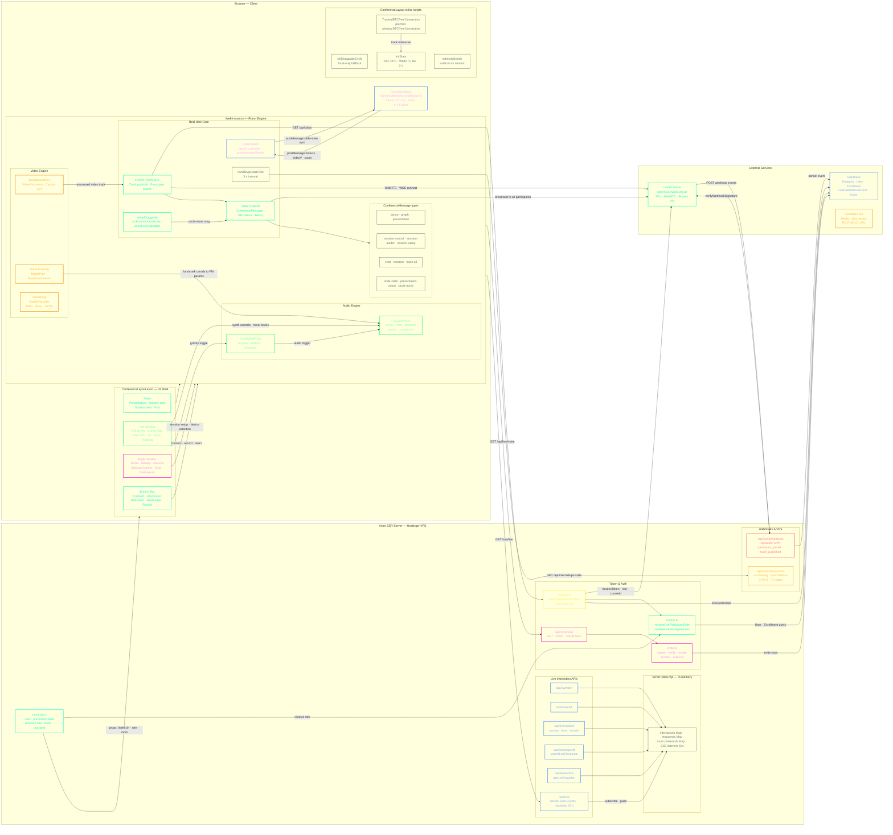

# Room LiveKit — Architecture Map

> Wireframe diagram of all connections, technologies and data flows in the Musiki live room system.




---

## Legend

| Color                    | Layer                                         |
| ------------------------ | --------------------------------------------- |
| 🟢 **Cyan** `#00ffc8`    | Core LiveKit path — room, tokens, WebRTC      |
| 🟢 **Lime** `#00ff66`    | Audio engine — FM Synth, Gravity Ball         |
| 🟣 **Magenta** `#ff00cc` | UI / Right sidebar — session, chat, invites   |
| 🟠 **Orange** `#ff8800`  | Video engine — blur, hand tracking, recording |
| 🔵 **Blue** `#4488ff`    | Presentation, SSE, Supabase queries           |
| 🟡 **Yellow** `#ffe000`  | Token generation API                          |
| 🔴 **Red** `#ff4466`     | Webhooks — incoming events from LiveKit       |
| ⬛ **Ghost** `#2a3a4a`    | Internal state, helpers, minor nodes          |

---

## Key data flows

```
Teacher joins
  → room.astro resolves role (Supabase)
  → ConferenceLayout renders with defaultRole="teacher"
  → livekit-room.ts fetches /api/token → LiveKit JWT
  → room.connect(wss://live.musiki.org.ar, jwt)
  → teacher publishes camera + audio tracks

Student joins (invite link)
  → /api/live/invite verifies code + scrypt password
  → room.astro hydrates with role="student"
  → JWT has canPublish=true, canSubscribe=true
  → session-control hidden (display:none for students)

Teacher drags circle
  → setupDraggable pointerMove
  → publishMessage({ type:"circle-move", x:0.4, y:0.3, identity:"focus-slot" })
  → LiveKit Data Channel RELIABLE broadcast
  → all participants receive → target.style.transform = translate(...)

Presentation sync
  → teacher selects slide → schedulePresentationLoad()
  → publishMessage({ type:"presentation", href:"/cursos/slides/..." })
  → all: iframe.src = href
  → Reveal postMessage → slide-state events back
  → publishMessage({ type:"slide-state", indexH, indexV, zoom })
  → all participants scroll to same slide

VPS stats
  → handleVpsStatsTick every 5 s
  → GET /api/internal/vps-stats
  → reads os.loadavg() + /proc/net/dev
  → [data-stat-cpu] and [data-stat-bw] updated with data-risk level
```


> ① SESSION CONTROL and INVITAR only visible to `role="teacher"` — `sessionControlsField.hidden = localRole !== 'teacher'`
