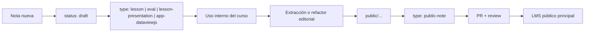

# Repo Manual

## 1. Decisión de arquitectura

Este repo debe quedar como **framework LMS + integración + despliegue**, no como vault editorial principal.

La regla de propiedad recomendada es esta:

- `26-musiki/` = carpeta contenedora del ecosistema local.
- `26-musiki/framework/` = framework, APIs, auth, DB, layouts, sync, deploy.
- `26-musiki/i1`, `26-musiki/i2`, `26-musiki/cym`, `26-musiki/s123` = repos/vaults por materia.
- El **source of truth** de una nota, incluso si termina siendo pública, sigue estando en el repo de la materia donde nació.
- El LMS público principal no debería editar contenidos directamente: debe **ensamblarlos** desde los repos de materia.

Esto coincide con lo que ya soporta el repo hoy mediante:

- `scripts/pull-sources.mjs`
- `scripts/assemble-content.mjs`
- `config/sources.manifest.json`
- `docs/content-sync-setup.md`

## 2. Qué se separa

### Framework

Va en `framework/`:

- `src/**`
- `scripts/**`
- `supabase/**`
- `astro.config.mjs`
- auth, live, foro, evaluaciones, renderers, plugins, deploy

### Contenido por materia

Va en un repo separado por materia, con nombres cortos acordados por la comunidad (`i1`, `i2`, `cym`, `s123`):

```text
musiki-materia-x/
  .obsidian/
  cursos/
  public/
  draft/
  assets/
  .github/workflows/
```

## 3. Un vault por materia

La mejor separación no es un vault por curso ni un vault por visibilidad, sino **un vault por materia**.

Razones:

- conserva wikilinks y contexto entre notas del mismo equipo docente;
- evita duplicar glosarios, bibliografía y notas puente;
- permite que `public/`, `cursos/` y `draft/` convivan con una sola convención editorial;
- deja el framework fuera del espacio de escritura docente.

## 4. Estructura canónica de un repo de materia

```text
cursos/
  <course-id>/
    _index.md
    01-unidad/
      01-introduccion.md
      02-lesson-presentation.md
      03-eval.md
      04-app-dataviewjs.md

public/
  topoi/
    nota-publica.md
  glosario/
    termino.md
  casos/
    caso.md

draft/
  incubadora/
  estudiantes/
  materiales-subsidiarios/
```

### Sentido de cada carpeta

- `cursos/`: contenido del LMS con contexto de curso. Puede requerir login y pertenencia.
- `public/`: notas públicas ya editorializadas. Entran por PR.
- `draft/`: materiales en preparación, subsidiarios o compartidos. No se publican al LMS por el ensamblado actual.

## 5. Taxonomía correcta: tipo, estado y visibilidad

Para que el sistema no mezcle conceptos, conviene separar tres ejes.

### A. Tipo de nota

Usar `type` para la forma pedagógica o técnica de la pieza:

- `course`
- `lesson`
- `eval`
- `lesson-presentation`
- `app-dataviewjs`
- `public-note`

Compatibilidad actual:

- `assignment` sigue siendo válido por retrocompatibilidad.

### B. Estado editorial

Usar `status` para el grado de maduración:

- `draft`
- `review`
- `approved`
- `published`
- `archived`

Punto importante:

- `draft` no debería ser un tipo; debería ser un **estado**.

### C. Visibilidad

Usar `visibility` sólo para excepciones de publicación:

- `public`

Punto importante:

- una nota puede ser `type: lesson` y `status: draft`;
- dentro de `cursos/**`, el alcance privado al curso es implícito;
- una nota puede originarse en un curso y luego convertirse en `type: public-note`.

## 6. Flujo editorial recomendado

El flujo que mejor ordena el sistema es este:



### Regla operativa

- La nota nace dentro del contexto de materia/curso.
- Si gana valor transversal, no se “expone sin más”: se **refactoriza** como nota pública.
- La versión pública debe vivir en `public/**` del repo de la materia.
- El LMS principal la consume desde allí.

## 7. Promoción desde curso a público

El repo ya soporta promoción automática desde `cursos/**` usando:

- `visibility: public`
- `public_status: approved`
- `public_path: ...`

Eso sirve como **puente de migración**.

### Best practice recomendada

- Mantener la promoción automática sólo como transición.
- La versión canónica de una nota pública debería terminar en `public/**`.
- No conviene que el LMS público dependa indefinidamente de notas “prestadas” desde carpetas de curso.

### Tipos que no deberían promocionarse automáticamente

Ya quedaron excluidos en la configuración:

- `assignment`
- `eval`
- `lesson-presentation`
- `app-dataviewjs`

Es decir: lo que se promueve al espacio público debería ser una **nota pública editorial**, no una evaluación, una slide deck o una app de clase.

## 8. Protocolo Git por actor

### Docentes de materia

Pueden trabajar en el repo de su materia.

Regla recomendada:

- `cursos/**`: se admite trabajo directo del equipo docente, porque es contenido privado o acotado al curso.
- `draft/**`: trabajo directo permitido.
- `public/**`: siempre por PR.

### Estudiantes

No deberían tener push directo sobre el repo oficial.

Regla recomendada:

- aportan por fork + pull request;
- sus materiales entran primero en `draft/estudiantes/**` o en una rama de trabajo equivalente;
- todo aporte estudiantil requiere review docente antes de merge;
- nada aportado por estudiantes debería pasar directo a `cursos/**` o `public/**` sin curaduría.

### Editores o coordinación académica

Revisan:

- claridad pública;
- estabilidad conceptual;
- enlaces y taxonomía;
- consistencia con otras materias.

### Developers

Trabajan sólo sobre este repo framework:

- `src/**`
- `scripts/**`
- `supabase/**`
- workflows de integración

El framework no debería ser modificado por docentes salvo casos excepcionales.

## 9. Regla de pull requests

Si quieren una “Wikipedia colaborativa basada en GitHub”, el punto fino es este:

- **PR obligatorio** para todo lo que entre en `public/**`.
- **PR recomendado** para cambios estructurales de `cursos/**`.
- **Push directo tolerado** para mantenimiento cotidiano de `cursos/**` y `draft/**` si el repo de materia es privado.
- **PR obligatorio** para cualquier aporte de estudiantes.
- **PR obligatorio y review técnico** para framework.

En otras palabras:

- lo público necesita revisión;
- lo privado de curso necesita velocidad;
- el framework necesita control técnico.

## 10. CODEOWNERS sugerido

Conviene formalizarlo con `CODEOWNERS` en cada repo de materia.

Ejemplo conceptual:

```text
/public/ @docente-responsable @editorial
/cursos/ @equipo-docente
/draft/ @equipo-docente
/.github/workflows/ @devs
```

Y en este repo framework:

```text
/src/ @devs
/scripts/ @devs
/supabase/ @devs
/config/ @devs
```

## 11. Frontmatter mínimo recomendado

### Curso

```yaml
---
type: course
title: Instrumento I
subtitle: acústica y organología
description: introducción a los instrumentos musicales
instructor:
  - Luciano Azzigotti
  - Agustín Salzano
  - Emanuel Juliá
year: 1
duration: 14 semanas
public: false
coverImage: https://i.imgur.com/dZ0GlW1.png
tags:
  - instrumentos
  - acústica
  - organología
  - cognición-digital-musical
id: i1
---
```

Convención recomendada:

- `id` es el identificador estable del curso para rutas, aliases e integraciones.
- `code` queda sólo como compatibilidad heredada si aparece material histórico.

### Lesson privada de curso

```yaml
---
type: lesson
title: Introducción a los gráficos cartesianos
status: draft
chapter: 01-acustica
order: 1
slug: graficos-cartesianos
---
```

### Evaluación

```yaml
---
type: eval
title: Cuestionario obligatorio Fundamentos de Acústica
status: review
chapter: 01-acustica
order: 3
points: 10
slug: cuestionario-fundamentos-acustica
---
```

### Nota pública

```yaml
---
type: public-note
title: Generatividad
status: published
slug: generatividad
---
```

### Puente de promoción transitoria

Sólo mientras migren:

```yaml
---
type: lesson
title: Introducción a la escucha acusmática
status: approved
visibility: public
public_status: approved
public_path: topoi/escucha-acusmatica.md
slug: escucha-acusmatica
---
```

## 12. Política para `draft`

`draft` no es basura ni borrador descartable. Es una incubadora compartida.

Punto importante:

- la carpeta `draft/` no equivale al campo `status: draft`; una nota puede vivir en `draft/` y tener otro estado editorial interno si hace falta.

Ahí deberían vivir:

- materiales subsidiarios;
- clases en preparación;
- aportes estudiantiles todavía no aprobados;
- recortes;
- notas de staging;
- prototipos de apps;
- bibliografía sin editorializar.

Regla:

- `draft` alimenta tanto a `cursos/` como a `public/`, pero no publica directo.

## 13. Decisión sobre la carpeta pública

Sí: la carpeta pública debe quedar en los repos de las materias.

Razón:

- conserva procedencia;
- deja claro quién mantiene cada nota;
- evita un repo público central convertido en basural editorial;
- permite que el LMS público principal ensamble sin quitar autoría ni contexto de origen.

Excepción:

- si aparece contenido verdaderamente transversal y sin materia dueña, ahí sí conviene abrir un repo editorial transversal aparte.

## 14. Migración sugerida

### Fase 1

- Congelar la idea de que `src/content` es el lugar de autoría.
- Tratar `src/content` como salida ensamblada del framework.

### Fase 2

- Crear un repo por materia.
- Mover ahí su vault Obsidian.
- Separar `cursos`, `public` y `draft`.

### Fase 3

- Configurar cada repo en `config/sources.manifest.json`.
- Activar `notify-platform-on-content-change.yml`.

### Fase 4

- Migrar las notas públicas históricas a `public/**`.
- Usar la promoción automática sólo mientras dure la transición.

### Fase 5

- Añadir `CODEOWNERS` y branch protection por repo.

## 15. Convenciones de operación

- `slug` debería ser obligatorio para toda nota pública nueva.
- Los nombres de archivo públicos deberían ser estables y sin depender del título visible.
- No usar `cursos/**` como depósito de notas públicas definitivas.
- No editar contenido fuente en este repo framework salvo durante la migración.
- Toda nota pública debe tener dueño académico claro.

## 16. Decisión final recomendada

La decisión más sólida hoy es:

1. Un repo/vault por materia.
2. Este repo queda como framework LMS.
3. En cada materia: `cursos`, `public`, `draft`.
4. `public` vive en la materia de origen y entra por PR.
5. `cursos` puede tener flujo más directo del equipo docente.
6. `draft` queda como incubadora no publicada.
7. El LMS principal ensambla todo, pero no se vuelve el lugar de autoría de contenidos.
